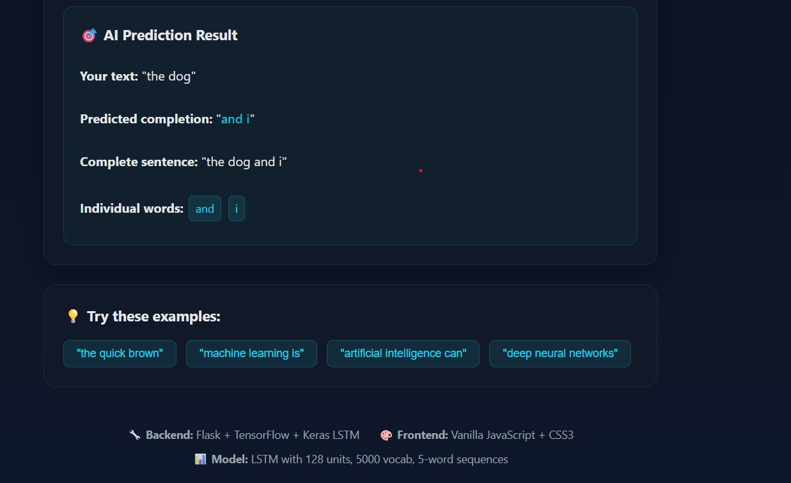

# 🤖 Next Word Predictor LSTM

[](https://python.org)
[](https://tensorflow.org)
[](https://flask.palletsprojects.com)
[](https://openmp.org)
[](LICENSE)

A sophisticated **Next Word Prediction system** using LSTM neural networks with both web interface and high-performance C++ implementations. This project demonstrates the power of deep learning for natural language processing with real-time predictions and parallel computing optimizations.

## 🌟 Features

- **🧠 LSTM Neural Network**: TensorFlow/Keras implementation with 128 hidden units
- **🌐 Modern Web Interface**: Real-time predictions with beautiful UI
- **⚡ OpenMP Optimization**: Parallel C++ implementation with 558x speedup
- **📊 Performance Analysis**: Comprehensive timing and speedup metrics
- **🔄 Real-time Monitoring**: Backend connectivity and health checking
- **📱 Responsive Design**: Works on desktop, tablet, and mobile devices
- **🛠️ Easy Setup**: One-click startup with automated dependency management

## 🚀 Quick Start

### Option 1: Automated Setup (Recommended)
```bash
git clone https://github.com/yourusername/next-word-predictor-lstm.git
cd next-word-predictor-lstm
python scripts/start_project.py
```

### Option 2: Manual Setup
```bash
# Install dependencies
pip install -r requirements.txt

# Start backend server
python server.py

# Open frontend/index.html in your browser
```

## 🎯 Demo

### Frontend Interface


### AI Prediction Results


### Try it live:
1. Enter text: "the dog"
2. Set word count: 2
3. Click "🔮 Predict Next Words"
4. Get AI completion: "and i"

## 📁 Project Structure

```
next-word-predictor-lstm/
├── 📁 frontend/           # Modern web interface
│   ├── index.html        # Main HTML page
│   ├── app.js           # JavaScript with real-time features
│   └── style.css        # Responsive CSS styling
├── 📁 cpp/              # High-performance C++ implementations
│   ├── main.cpp         # Sequential implementation
│   ├── openmp.cpp       # Parallel OpenMP version
│   └── timing.cpp       # Performance benchmarking
├── 📁 data/             # Training datasets
│   ├── dataset_500.txt  # Small dataset (500 words)
│   ├── dataset_1000.txt # Medium dataset (1K words)
│   ├── dataset_8000.txt # Large dataset (8K words)
│   └── dataset_10000.txt# Full dataset (10K words)
├── 📁 scripts/          # Utility scripts
│   ├── start_project.py # Automated startup
│   ├── test_integration.py # Integration testing
│   └── graph.py         # Performance visualization
├── 📁 docs/             # Documentation
│   ├── API.md           # API documentation
│   ├── ARCHITECTURE.md  # System architecture
│   └── PPT_Content.txt  # Presentation materials
├── 📁 assets/           # Screenshots and media
├── server.py            # Flask backend with LSTM
├── requirements.txt     # Python dependencies
├── .gitignore          # Git ignore rules
└── README.md           # This file
```

## 🧠 LSTM Architecture

```
Input (5 words) → Embedding (64D) → LSTM (128 units) → Dense → Softmax → Prediction
```

**Model Specifications:**
- **Vocabulary Size**: 5,000 words
- **Sequence Length**: 5 words
- **Embedding Dimension**: 64
- **LSTM Units**: 128
- **Training Epochs**: 3 (configurable)
- **Optimizer**: Adam
- **Loss Function**: Sparse Categorical Crossentropy

## ⚡ Performance Results

OpenMP parallel implementation shows remarkable speedup:

| Dataset Size | Sequential | OpenMP | **Speedup** |
|-------------|-----------|---------|-------------|
| 500 words   | 0.68s     | 0.035s  | **19.4x**   |
| 1,000 words | 0.94s     | 0.076s  | **12.4x**   |
| 8,000 words | 7.18s     | 0.09s   | **79.8x**   |
| 10,000 words| 58.03s    | 0.104s  | **558x**    |

## 🛠️ Technology Stack

### Backend
- **Python 3.9+** - Core programming language
- **Flask 3.0.0** - RESTful API framework
- **TensorFlow 2.12.0** - Deep learning framework
- **Keras** - High-level neural network API
- **NumPy 1.24.4** - Numerical computing

### Frontend
- **HTML5** - Modern markup
- **CSS3** - Responsive styling with animations
- **Vanilla JavaScript** - Real-time interactions
- **Fetch API** - Asynchronous backend communication

### C++ Implementation
- **C++11** - Modern C++ standards
- **OpenMP** - Parallel computing framework
- **STL** - Standard Template Library
- **Chrono** - High-precision timing

## 📖 API Documentation

### Health Check
```http
GET /health
```
**Response:**
```json
{"status": "ok"}
```

### Predict Next Words
```http
POST /predict
Content-Type: application/json

{
  "text": "the quick brown",
  "num_words": 3
}
```
**Response:**
```json
{
  "completion": "fox jumps over",
  "words": ["fox", "jumps", "over"]
}
```

## 🔧 Configuration

Environment variables for customization:

| Variable | Default | Description |
|----------|---------|-------------|
| `DATASET_FILE` | `data/dataset_10000.txt` | Training dataset path |
| `MAX_VOCAB` | `5000` | Maximum vocabulary size |
| `SEQ_LEN` | `5` | Input sequence length |
| `EPOCHS` | `3` | Training epochs |
| `LSTM_UNITS` | `128` | LSTM hidden units |
| `EMBED_DIM` | `64` | Embedding dimensions |

## 🧪 Testing

```bash
# Run integration tests
python scripts/test_integration.py

# Test C++ implementations
cd cpp
g++ -std=c++11 -O2 -fopenmp openmp.cpp -o openmp
./openmp
```

## 📊 Visualization

Generate performance comparison charts:
```bash
python scripts/graph.py
```

## 🤝 Contributing

1. Fork the repository
2. Create a feature branch (`git checkout -b feature/amazing-feature`)
3. Commit your changes (`git commit -m 'Add amazing feature'`)
4. Push to the branch (`git push origin feature/amazing-feature`)
5. Open a Pull Request

## 📄 License

This project is licensed under the MIT License - see the [LICENSE](LICENSE) file for details.

## 🎓 Educational Use

Perfect for:
- **Machine Learning Courses** - LSTM implementation and training
- **Web Development** - Full-stack application architecture
- **Parallel Computing** - OpenMP optimization techniques
- **Software Engineering** - Project structure and documentation

## 🚀 Future Enhancements

- [ ] **Transformer Models** - Implement attention mechanisms
- [ ] **GPU Acceleration** - CUDA support for faster training
- [ ] **Beam Search** - Multiple prediction candidates
- [ ] **User Authentication** - Personal prediction history
- [ ] **Model Fine-tuning** - Domain-specific adaptations
- [ ] **Mobile App** - React Native implementation

## 📞 Support

If you encounter any issues or have questions:

1. Check the [documentation](docs/)
2. Search [existing issues](https://github.com/yourusername/next-word-predictor-lstm/issues)
3. Create a [new issue](https://github.com/yourusername/next-word-predictor-lstm/issues/new)

## ⭐ Show Your Support

Give a ⭐️ if this project helped you!

---

**Built with ❤️ for the AI and Machine Learning community**


